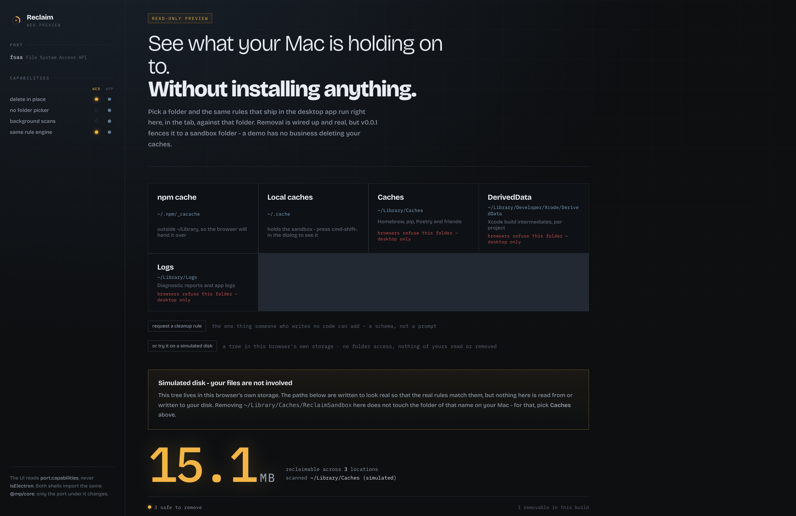
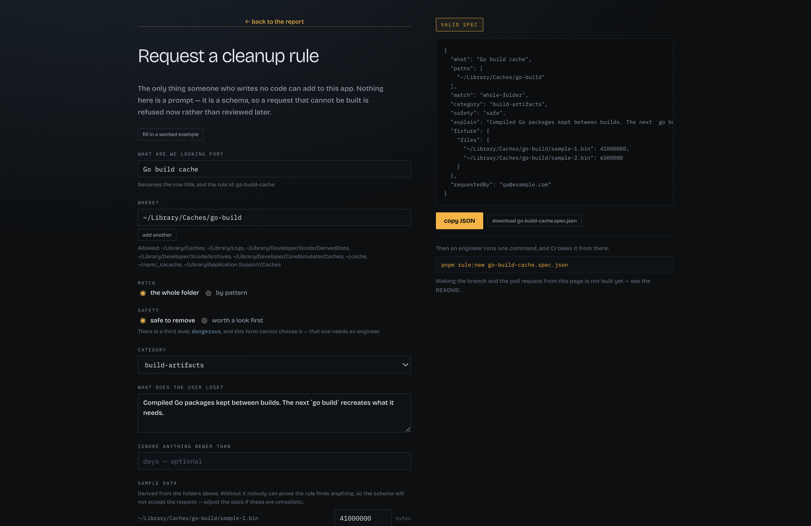
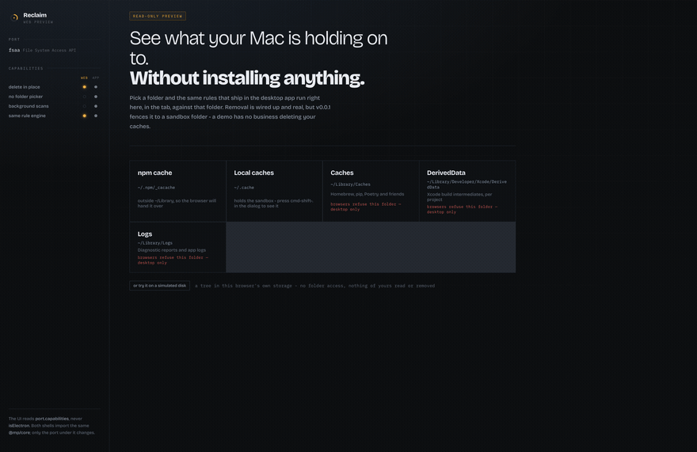
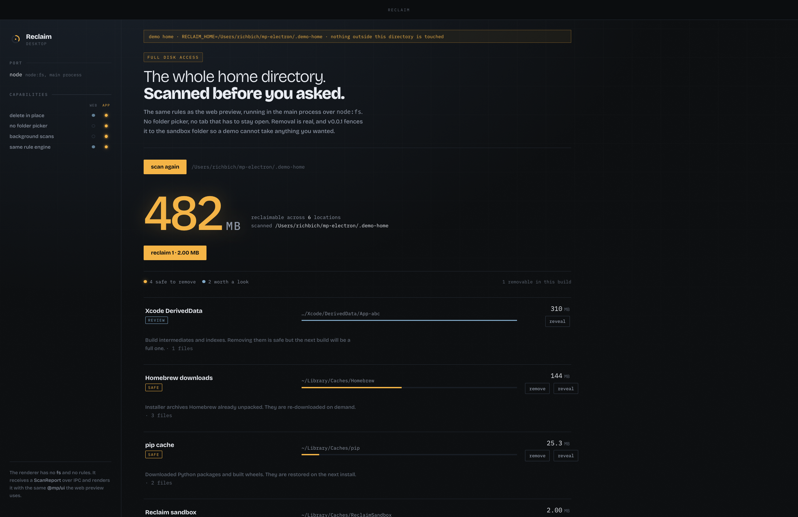

# Reclaim

[](https://github.com/akaRichBich/mp-electron/actions/workflows/ci.yml)

**[Try it →](https://akarichbich.github.io/mp-electron/)** — no install, no
folder access needed. Works in Firefox and Safari too.

A macOS disk-cleanup utility, built to answer a narrower question:

> How much of a codebase can you hand to an agent, if the boundaries are
> enforced by a machine instead of by whoever reviews the pull request?

The disk cleaner is the substrate. The interesting part is the harness around
it — and the architecture underneath, which is what makes the harness cheap
enough to be strict.

### Status: a proof of concept, not a product

The harness itself works end to end today. The spec schema, the path fence, the
gates and the per-rule evals all run — a request really does become a rule that
CI has checked, and the transcript further down is a real one.

There is a [form](https://akarichbich.github.io/mp-electron/#request) too, so
the request itself needs no engineer: it validates against the same schema as
the CLI, refuses a bad path while you type, and exports a spec file that
`pnpm rule:new` accepts unchanged.

What does not exist is everything after that. The spec file is handed over by a
human — no branch, no pull request, no preview build is created from the page.
Read the sections below as *the machinery a self-service tool needs*, which is
built and checked, rather than as a finished self-service product, which this
is not.



## The harness

Four things, in descending order of how much work they save.

### 1. One architectural rule, machine-enforced

`CLAUDE.md` states exactly one rule: `packages/core` never touches the
platform. Every filesystem call goes through `FsPort`. `pnpm check:arch` fails
the build on a `node:` import, an `electron` import or a DOM global in core —
and holds `packages/ui` to the same rule minus the DOM.

This is not a convention an agent is asked to remember. It is a grep with an
exit code, and it runs before the tests.

### 2. A request anyone can make, and a recipe for turning it into code



The form is the schema. Every field is validated against the same `RuleSpec`
the CLI uses, so a path outside the fence is refused as you type — with the
sentence the CLI would print — and the export buttons stay disabled until the
spec is genuinely valid. Sample data is required and derived from the folders
you named, because inventing plausible file paths is not a thing to ask a PM
for.

There is no third safety level to choose: `dangerous` exists in the contract
and the form cannot select it.


On the other side, `recipes/add-rule.md` describes adding a cleanup rule and
nothing else. The
prompt that starts it is *generated*, not written — `pnpm rule:new` renders it
from a validated spec, so the same request always produces the same prompt, and
a bad result is a bug in the recipe rather than in someone's phrasing.

### 3. Fences, not warnings

| fence | where it lives | what it stops |
|---|---|---|
| path allowlist | `RuleSchema`, at import time | a rule pointing at `~/Documents` cannot be *registered*, let alone shipped |
| `dangerous` is report-only | `deletionVerdict`, checked in main | the renderer cannot ask for it, and is refused if it does |
| deletion policy | `DELETABLE_RULES` | v0.0.1 only removes inside a sandbox folder |
| file scope | the generated prompt | four files may change; the rest of the tree is not the agent's |
| no new dependencies | CI, on `rule/*` branches | a rule never needs one |

Each of these is a place where being wrong is *impossible* rather than
*discouraged*.

### 4. Gates that fail legibly

`pnpm gates` — cheapest first, so a bad rule fails in seconds with a sentence:

```
typecheck     types across eight projects
check:arch    core and ui stay platform-free
test          36 tests, including a contract test all three ports must pass
eval          every rule, against fixtures that ship with the repo
build         both shells still build
```

Each rule carries four eval checks: it parses against the contract, it is
actually registered, it finds something in its own fixture and nothing under
`~/Documents`, and it did not reach for the filesystem.

A real request going through — a QA spec for the Go build cache:

```
$ pnpm rule:new packages/harness/examples/go-build.spec.json
wrote packages/harness/fixtures/go-build-cache.json
wrote packages/harness/src/eval/cases/go-build-cache.json

$ pnpm eval
go-build-cache   FAIL schema_valid  FAIL registered_in  FAIL runs_against
25/28 checks passed (89%) across 7 rules
  - go-build-cache / schema_valid: rule "go-build-cache" is not in the registry

# …agent follows recipes/add-rule.md…

$ pnpm eval
go-build-cache   PASS schema_valid  PASS registered_in  PASS runs_against
28/28 checks passed (100%) across 7 rules
```

And a request that never gets that far:

```
$ pnpm rule:new packages/harness/examples/pnpm-store.spec.json
This spec cannot be submitted:
  - paths.0: "~/Library/pnpm/store" is outside every allowed prefix
```

The full path, written for the people who start it, is in
[docs/adding-a-rule.md](docs/adding-a-rule.md).

## What the gates actually caught

The honest version, because "we have CI" means nothing on its own. Two columns:
what machinery found, and what a human found — with the gate that exists now so
it cannot happen twice.

**Caught by a gate, before anyone looked**

- The fake and node ports disagreed about directory age. A directory's own
  mtime is set by the OS when an entry is added, and an in-memory fixture has
  none — so the same tree produced different findings. The fix belonged in the
  domain: age is measured from the newest file *inside*. Found by the
  cross-port contract test, which exists for exactly this.
- Reachability was decided per rule instead of per matcher, so a rule with two
  locations had both evaluated as soon as either was in reach — reporting
  findings outside the port's own mounts. Real ports hid it; the fake port did
  not.

**Caught by a human, then gated**

- A `Logs` folder was offered in the picker with no rule looking at it: a
  button that could only ever find nothing. Gate added — every mount the picker
  offers must produce a finding against the reference fixture.
- The remove button appeared for `dangerous` findings, contradicting the
  contract. The fix went into `partitionRemovable` in the main process, not the
  UI, because the renderer is not trusted to keep that promise. Test added
  against tampered reports.
- Several silent failures: a missing `RECLAIM_HOME` reporting a clean disk, a
  removal that threw and said nothing, a blocked folder indistinguishable from
  a cancelled dialog. Each now says what happened, and a removal re-checks the
  path afterwards rather than trusting that the call resolved.

The pattern is the point. Gates catch what is mechanically checkable and
nothing else; everything a human catches becomes a new gate.

## Why the substrate makes the harness cheap

`packages/core` holds the whole domain and has no idea where it runs. Every
filesystem call goes through one interface:

| port | package | shell | delete | no picker | background |
|---|---|---|---|---|---|
| `FakeFsPort` | `@mp/core` | tests, evals | yes (in memory) | yes | yes |
| `NodeFsPort` | `@mp/port-node` | Electron | yes | yes | yes |
| `FsaaFsPort` | `@mp/port-fsaa` | PWA | after a grant | **no** | **no** |

The fake port exists because two shells needed the abstraction anyway. It then
turned out to be the thing that makes generated code verifiable: evals run
headless, in milliseconds, with no Mac and no disk, and deterministically —
scans take `now` as an option and fixtures carry `ageDays`.

That is the argument in one line: **the architecture that made two shells
possible is the architecture that made an agent's output checkable.**

Two boundaries, not one. `FsPort` bounds the domain; `ScanReport` plus
`PortCapabilities` bounds the UI. The web shell runs both sides in one process;
the desktop shell puts a process boundary between them. Neither the core nor
the UI notices.

## The two shells



The capability matrix in the rail is rendered from `SHELL_CAPABILITIES` — the
same table the ports import — so the UI branches on `port.capabilities`, never
on `isElectron`, and the matrix cannot drift from what the ports do.

**The web shell** picks a folder and scans it. Then macOS bites: Chromium
blocks `~/Library` and everything under it for the File System Access API
(`kBlockAllChildren`, in `chrome_file_system_access_permission_context.cc`), so
`~/Library/Caches`, `~/Library/Logs` and Xcode's DerivedData — the three places
a Mac actually hoards — cannot be handed to a tab at all, however the user
answers the dialog. The app says so on those cards instead of failing
mysteriously, and offers `~/.npm/_cacache`, which works.

That is the sharpest version of why the desktop shell exists. Not "the browser
is slower" — the browser is not allowed.

It also ships a **simulated disk** on the Origin Private File System, so the
whole flow including a real deletion can be tried in any browser without
granting the page anything. Its paths are labelled as simulated everywhere they
appear — an earlier version was not, and a deletion that worked perfectly
looked broken because the folder it named was still sitting on disk.



**The desktop shell** runs the scan in a **utility process**, not in main.
Walking a real `~/Library/Caches` is hundreds of thousands of stat calls; on
main's event loop that is the window freezing while it happens, since main also
serves window events, IPC and the tray. Out there it is someone else's event
loop — and cancelling is `child.kill()` rather than a flag the walk has to
remember to check. The renderer gets a finished `ScanReport` over IPC and holds
no fs, no rules, and no core logic beyond types.

Deletion is real, and treated as a boundary: every path the renderer asks for
is re-checked in main against the report main itself produced, against the
allowlist, and against the deletion policy — and then a native dialog asks the
human.

## What v0.0.1 will actually delete

One folder, on purpose. The delete path is real and completely wired in both
shells, but a demo of an architecture has no business emptying a stranger's
Homebrew cache because a rule was slightly wrong.

```bash
pnpm demo:sandbox
```

It makes two, because a browser may not open anything under `~/Library`: the
desktop app finds `~/Library/Caches/ReclaimSandbox`, the web app finds
`~/.cache/ReclaimSandbox` under **Local caches** (cmd-shift-. reveals hidden
folders in the dialog). Everything else offers the button and then explains why
it will not act.

Shipping for real means adding the other `safe` rules to one list in
`packages/core/src/safety/deletion-policy.ts`. Nothing else changes.

## Running it

```bash
pnpm install
pnpm gates          # typecheck, arch guard, tests, evals, both shell builds
pnpm dev:web
pnpm demo:home && RECLAIM_HOME="$PWD/.demo-home" pnpm dev:desktop
```

`RECLAIM_HOME` must be absolute — Electron's working directory is
`apps/desktop`, not the shell you typed it in — and the app says so on screen
when the path does not resolve.

To see what the rules would report here, with no UI at all:

```bash
pnpm dry-run                        # every rule, read-only
pnpm dry-run --rule stale-app-logs
```

The screenshots above are regenerated by the app itself
(`RECLAIM_SHOT=… pnpm dev:desktop`), so they show whatever it currently renders
rather than something cropped by hand six versions ago.

## Not done, deliberately

Packaging and code signing. `electron-builder`, notarisation and an update
channel are real work, and none of it would say anything new about the
architecture or the harness — which is what this repository is for.

Automatic branches, pull requests and preview builds from the request form.
The form exports a valid spec file; a human still carries it the last step.
That gap is the difference between the proof of concept described at the top
and a finished self-service product.
